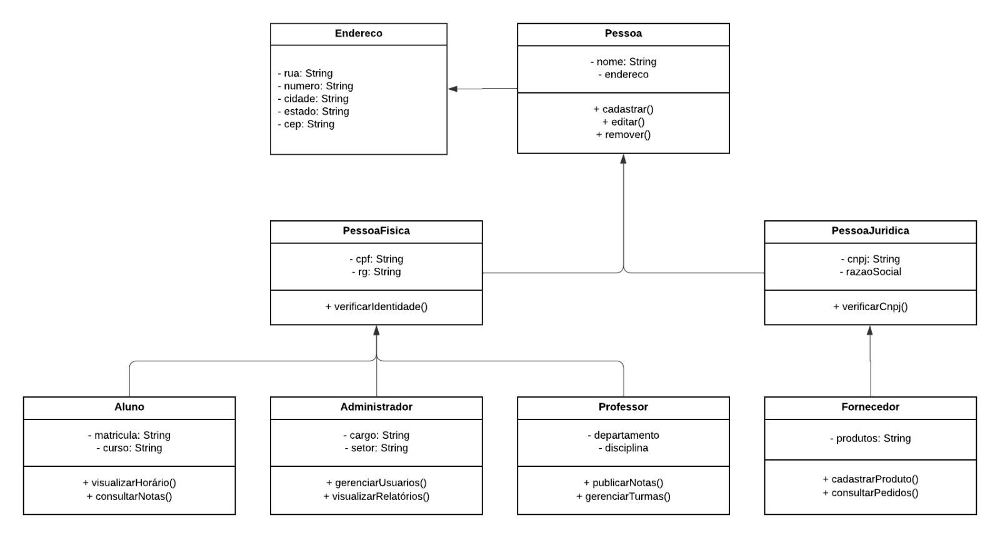
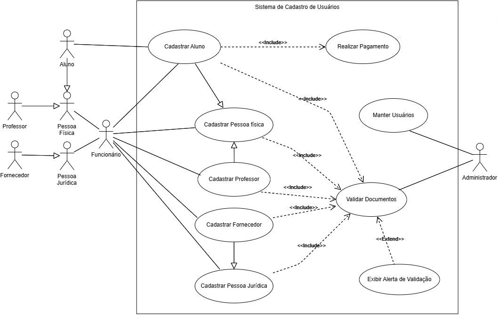

# EducaAccessControl

Este projeto tem como objetivo desenvolver um aplicativo que facilita o gerenciamento de alunos, professores e fornecedores na universidade, incluindo cadastro, validação de documentos e processos de pagamento.

## Visão Geral

O aplicativo de gestão universitária visa otimizar a administração de cadastros e validação de informações, além de gerenciar os pagamentos de maneira ágil e simples. Ele oferece diferentes funcionalidades para atender a alunos, professores, administradores e fornecedores de forma eficiente. O sistema automatiza processos e melhora a experiência de todos os usuários.

## Funcionalidades do Aplicativo

### 1. Tela Inicial / Login

**Objetivo:** Controlar o acesso ao sistema e direcionar os usuários para as funcionalidades adequadas.

**O que você encontrará:**
- Campos para inserção de e-mail e senha.
- Opção de recuperação de senha em caso de esquecimento.
- Link para criar uma nova conta (cadastro).
- Mensagem de boas-vindas com o logo da universidade.

### 2. Tela de Seleção de Formulário

**Objetivo:** Permitir que o usuário escolha qual tipo de cadastro deseja realizar.

**O que você encontrará:**
- Botões para selecionar entre as opções de cadastro: Aluno, Professor ou Fornecedor.
- Informações claras sobre os requisitos para cada tipo de cadastro (documentos necessários, por exemplo).
- Opção de reenvio para corrigir dados, caso necessário.

### 3. Tela de Cadastro

**Objetivo:** Coletar dados do usuário e os documentos necessários para validação.

**O que você encontrará:**
- Formulário dinâmico que se adapta conforme o tipo de usuário:
  - Aluno: Nome, CPF, curso, matrícula, data de nascimento.
  - Professor: Nome, CPF, área de atuação, especialidade.
  - Fornecedor: Nome da empresa, CNPJ, endereço, representante legal.
- Campo para fazer o upload de documentos obrigatórios (ex: RG, comprovantes, diplomas).
- Validação dos campos no frontend para garantir que os dados estejam corretos antes de enviar.
- Botão para enviar o formulário.

### 4. Tela de Validação pelo Administrador

**Objetivo:** Permitir que o administrador revise, aprove ou rejeite os cadastros e documentos.

**O que você encontrará:**
- Lista de solicitações pendentes para validação, com detalhes do nome do solicitante e tipo de cadastro.
- Detalhamento dos documentos enviados, com opção para fazer download.
- Botões para aprovar ou rejeitar as solicitações, com campo para justificar a decisão.
- Status da solicitação (Aguardando, Aprovado, Rejeitado).

### 5. Tela de Edição de Cadastro

**Objetivo:** Permitir que os usuários corrijam ou atualizem dados ou documentos.

**O que você encontrará:**
- Formulário pré-preenchido com as informações que precisam ser corrigidas.
- Opção para upload de novos documentos.
- Mensagens que informam exatamente quais dados ou documentos precisam ser corrigidos.
- Botão para enviar as correções.

### 6. Tela de Status do Cadastro

**Objetivo:** Informar ao usuário o status do seu cadastro.

**O que você encontrará:**
- Mensagem clara sobre o status do cadastro: "Aguardando Validação", "Rejeitado", "Aprovado".
- Histórico das ações realizadas no cadastro.
- Link para editar os dados, caso haja alguma rejeição.

### 7. Tela de Pagamento (Para Alunos)

**Objetivo:** Gerenciar os pagamentos realizados pelos alunos.

**O que você encontrará:**
- Resumo do pagamento, incluindo valor, prazo e forma de pagamento disponível (boleto, cartão de crédito, etc.).
- Status do pagamento (Pendente, Concluído, Erro no Pagamento).
- Botão para reencaminhar o pagamento em caso de falha.

### 8. Tela de Pós-Cadastro

**Objetivo:** Oferecer funcionalidades após o cadastro, dependendo do tipo de usuário.

**O que você encontrará:**
- **Alunos:** Acesso para inscrição em disciplinas, com filtros por curso e semestre.
- **Professores:** Acesso para inscrição em turmas e horários para lecionar.
- **Fornecedores:** Opções para envio de propostas e gerenciamento de contratos.

### 9. Tela de Relatórios e Painel Administrativo

**Objetivo:** Apresentar informações detalhadas sobre o andamento do sistema para os administradores.

**O que você encontrará:**
- Resumo de cadastros aprovados e pendentes.
- Gráficos de distribuição de alunos por curso e de fornecedores por categoria.
- Histórico de validações realizadas.
- Opções para exportar relatórios (PDF, Excel).

## Casos de Uso

### [UC001] Cadastrar Aluno

**Ator:** Aluno  
**Pré-condição:** O aluno deve ter acesso à internet.  
**Pós-condição:** O aluno será registrado no banco de dados da universidade e poderá se inscrever em disciplinas.

**Fluxo Principal:**
1. O aluno seleciona o formulário de cadastro.
2. O aluno preenche os dados no formulário.
3. O aluno faz o upload dos documentos necessários.
4. O aluno envia o formulário.
5. O administrador valida os documentos e dados do aluno.
6. O aluno recebe um e-mail com as instruções para o pagamento.
7. O aluno realiza o pagamento.
8. O aluno é registrado no banco de dados da universidade.
9. O aluno pode se inscrever nas disciplinas.

**Fluxos Alternativos:**
- **Documento inválido:** Se algum documento ou dado estiver incorreto, o aluno receberá um aviso e poderá corrigir as informações.
- **Falha no pagamento:** Se houver erro no pagamento, o aluno será redirecionado para refazer o pagamento.

### [UC002] Validar Documentos

**Ator:** Administrador  
**Pré-condição:** O administrador deve estar autenticado no sistema.  
**Pós-condição:** Os documentos são classificados como válidos ou inválidos.

**Fluxo Principal:**
1. O administrador abre a tela de solicitações de cadastro.
2. O administrador seleciona um usuário para validar.
3. O administrador avalia os documentos enviados.
4. O administrador classifica os documentos como válidos ou inválidos.
5. O administrador envia um e-mail confirmando a validação ou solicitação de correção.

**Fluxos Alternativos:**
- **Documentos inválidos:** O administrador envia um alerta ao aluno, solicitando correções.
- **Usuário Aluno:** Caso o cadastro seja de um aluno, o sistema envia um e-mail com instruções de pagamento após a validação dos documentos.

### [UC003] Realizar Pagamento

**Ator:** Aluno  
**Pré-condição:** O aluno deve ter os documentos validados.  
**Pós-condição:** O pagamento será classificado como ativo ou pendente.

**Fluxo Principal:**
1. O sistema envia um link para o e-mail do aluno com o formulário de pagamento.
2. O aluno realiza o pagamento.
3. O sistema atualiza o status do pagamento como "ativo".

**Fluxo Alternativo:**
- **Falha no pagamento:** Se ocorrer uma falha, o status de pagamento será "pendente" e o aluno poderá tentar novamente.

### [UC004] Exibir Alerta de Validação

**Ator:** Administrador  
**Pré-condição:** O administrador deve estar autenticado no sistema.  
**Pós-condição:** O aluno recebe um alerta de falha na validação com um link para corrigir os dados.

**Fluxo Principal:**
1. O administrador valida os documentos.
2. Se algum documento for inválido, um alerta será enviado para o aluno com um link para corrigir os dados.

