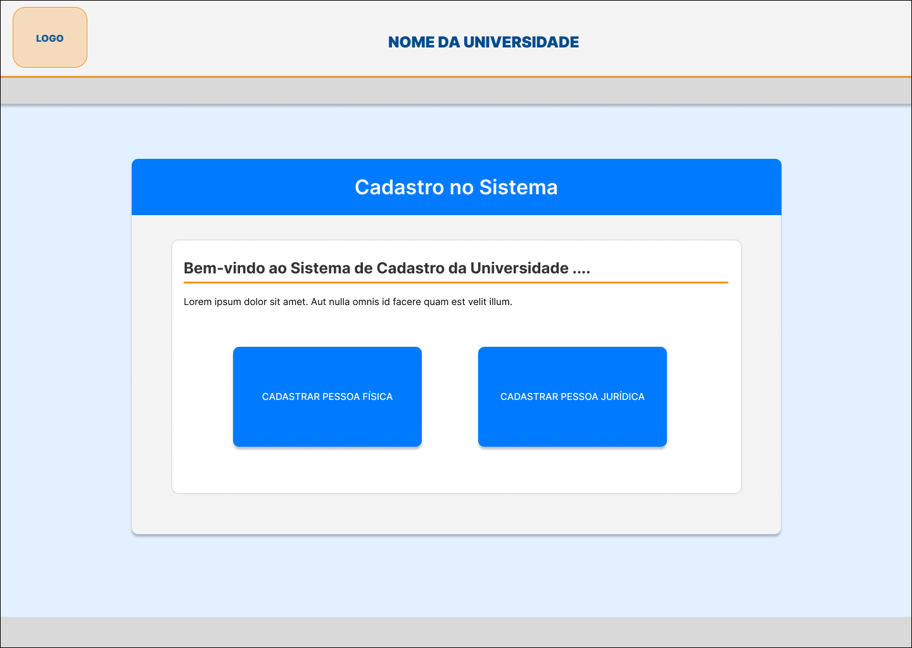
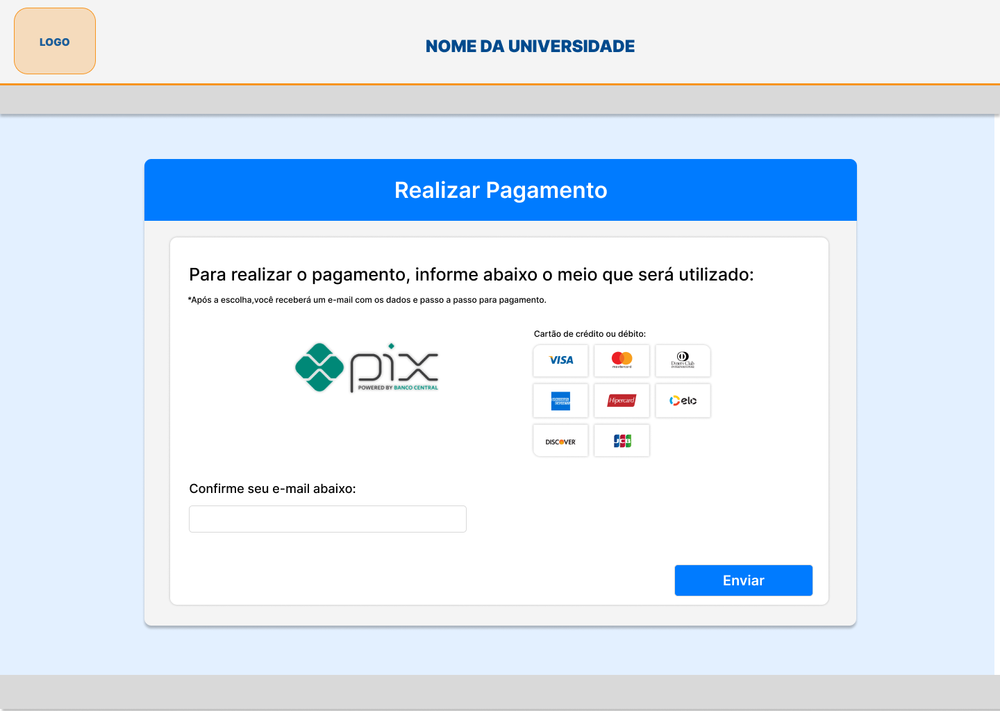

# EducaAccessControl

## Objetivo do Projeto

Este projeto tem como objetivo desenvolver um aplicativo que facilita o gerenciamento de alunos, professores e fornecedores na universidade. Ele abrange processos de cadastro, validação de documentos e gestão de pagamentos.

## Visão Geral

O aplicativo EducaAccessControl visa otimizar a administração de cadastros e validação de informações, além de gerenciar pagamentos de maneira ágil e simples. Ele foi projetado para atender diferentes perfis de usuários: alunos, professores, administradores e fornecedores, automatizando processos e melhorando a experiência de uso.

## Funcionalidades do Aplicativo

### Seleção de Formulário
- Escolha entre cadastro de **Pessoa Física** ou **Pessoa Jurídica**.
- Exibição dos dados e documentos necessários para cada tipo de cadastro.

### Cadastro de Conta
- Cadastro de conta de aluno, professor ou fornecedor.
- Preenchimento de informações pessoais (nome, CPF, e-mail, etc.).
- Upload de documentos obrigatórios (ex.: RG, diploma, CNPJ).
- Validação de dados e documentos pelo administrador.
- Edição de cadastro em caso de dados incorretos ou incompletos.

### Edição de Cadastro
- Correção de dados e documentos após rejeição.

### Pagamentos (Alunos)
- Escolha do método de pagamento e envio por e-mail.

## Descrição

### 1. Tela de Cadastro no Sistema
**Objetivo:** Iniciar o processo de cadastro, permitindo a escolha entre Pessoa Física ou Pessoa Jurídica.

### 2. Tela de Cadastro de Pessoa Jurídica
**Objetivo:** Coletar os dados e documentos necessários para cadastro de Pessoas Jurídicas.

**Funcionalidades:**
- Formulário com campos como:
  - Razão social.
  - Nome fantasia.
  - CNPJ.
  - Inscrição estadual.
  - Inscrição municipal.
  - Data de fundação.
- Botão para envio do formulário.
  
### 2.1 Tela de Cadastro de Fornecedores
**Objetivo:** 

**Funcionalidades:**
- Formulário com campos como:
  - Porte da empresa.
  - Enquadramento tributário.
  - Endereço completo.
  - Responsável da empresa.
  - Informações de contato.
- Botão para envio do formulário.

### 3. Tela de Cadastro de Pessoa Física
**Objetivo:** Coletar os dados necessários para cadastro de Pessoas Físicas, como Alunos e Professores.

**Funcionalidades:**
- Formulário com campos como:
  - Nome completo.
  - CPF.
  - Data de nascimento.
  - Escolha entre aluno e professor.
  - Endereço.
- Botão para envio do formulário.

### 3.1 Tela de Cadastro de Pessoa Física - Aluno
**Objetivo:** Coletar os documentos necessários para Alunos.

**Funcionalidades:**
- informações de cadastro do aluno.
- Selecionar tipos de documentos (ex.: RG, Comprovante de Matrícula, Histórico Escolar).
- Upload de documentos obrigatórios.
- Seleção do curso.
- Botão de envio.

### 3.1.1 Tela de Pagamento (Para Alunos)
**Objetivo:** Gerenciar pagamentos realizados pelos Alunos.

**Funcionalidades:**
- Escolher o método de pagamento.
- Confirmar o e-mail para envio com o passo a passo para efetuar o pagamento.

### 3.2 Tela de Cadastro de Pessoa Física - Professor
**Objetivo:** Coletar os documentos necessários para Professores.

**Funcionalidades:**
- Seleção do tipo de documento.
- Upload de documentos obrigatórios.
- Seleção do departamento.
- Seleção das disciplinas.
- Botão de envio.

## Protótipo do Projeto

### 1. Seleção Inicial do Tipo de Cadastro

### Fluxo Pessoa Física

#### Fluxo Professor

#### Fluxo Aluno 

### Fluxo Fornecedor

## Caso de Uso

## Diagrama de Classe

